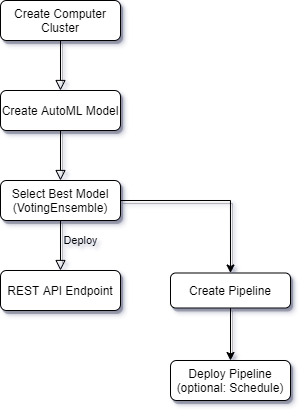
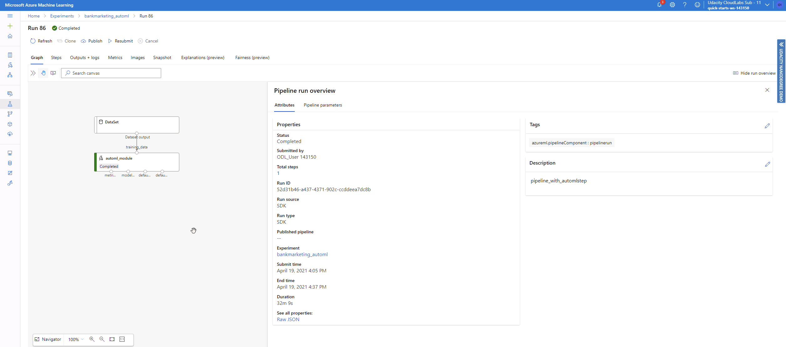

# Operationalizing-Machine-Learning-Udacity-Project2
*NOTE: These files are those modified and used in the Machine Learning Engineer with Microsoft Azure Nanodegree Program, second project: Operationalizing ML*

## Overview
This project facus on the deployment side of an Azure ML model to an Endpoint, where it can be consumed by other users as a web service using a REST API.

An AutoML model is created based on the Bank Marketing dataset, and the best model is deployed for its consumption. The deployement is tested to check that it can be accessed, has the correct access and there is adequate documentation (through Swagger) for those using it. A check is done to verify that the model deployed provides a model prediction from a json package with model data.

Then a pipeline is created and also deployed, and all is checked against the rubric.

A **screencast** showing the architecture and the different models and endpoints in the Azure Studio is shown at the following location: [Udacity-AzureML_project2](https://youtu.be/WRcBkJeVtV4)

And the following diagram provides the architecture followed during the process to obtain the end result:

## Future improvements
The possibility of deploying a model in the web, or a pipeline, opens the possibility for different scenarios. Some ideas of how this project can be extended are:

 - Creating a web page with a form that allows a user to include their data using a form and obtain a prediction from the model.
 - Serving a company or department predictions using the REST API to make predictions from the model, be it from a mobile application or even from a company desktop
 - Having a pipeline available allows to update the model when the data changes. Scheduling the pipeline (not implemented in this example) would automatically update the model and redeploy it.
 - Creating a benchmark that allows to detect deviation from the baseline would further improve the redeployment.

## Details of the Run
As part of the project, several screenshots were taken during the process to demonstrate how it was done. You can find the most interesting examples below:

### Creating the Service Principal and sharing the resource

As this example was done in the provided lab, the service principal could not be created due to the existing permissions restrictions. Same for the sharing. But the following image show the commands that would need to be implemented and how to obtain the user.

### Dataset, Experiments and Models
The first step is to register the dataset that will be used by the AutoML process.

The dataset Bank marketing consists on data pertaining to a marketing campaign that determines if a customer contacted by the campaign will contract the product or not. 

AutoML is run using the dataset, and the best model is used as the candidate to be deployed. In this case the model is a VOtingEnsemble model with an accuracy of about 92%.

Different models have been run, as it can be seen in the following image. The ensemble models seem to be the ones performing best among all.

Some more details of the Voting Ensemble model that will be used to deploy it as a REST API web service.

### Application Insights

Once the model has been deployed, and authentication has been enabled, it is possible to monitor the web service by enabling the application insights. This can be done during the deployment process, but it can also be done after the fact, by activating it using the AzureML-SDK, as shown here.

After running the previous code, it is possible to check that the application insights are active, as seen in the bottom left part of this image, with the rest of the information about the deployed model.

This allows to monitor the service from the Azure studio in real time and obtain important information as the requests, availability, failed requests or response times, in case the service needs to address any potential issue.

### Swagger documentation
Swagger was locally deployed to check it worked correctly. 

Swagger allows for somebody using the REST API, to check the API methods and requirements of the data that will be provided to the model. This is done using a web interface. In this case, the swagger has been configured to run locally and configured using the swagger.json file that contains the REST API information.

### API Run
With the model deployed and active, it is always a wise step to check that everything is working. To validate that the model has been correctly deployed, a python script has been run against the REST API endpoint, providing some model data in the shape requested by the API (And that can be checked using the swagger documentation). The server runs the data against the model and provides a prediction. In this case we provided two sets of data, the first one - according to the model - will probably contract the product, meanwhile the second one will not. Should we dedicate our valuable marketing resources to someone else??

## Pipelines
The AUtoML model is used to create a pipeline. One is created and deployed and the following sections show proof of the process.

### Pipelines Run

Pipelines are useful to automate things like processing new data, creating a new model in the same way as it was done the first time, and even redeploying it as a web service.
Here we have configured a pipeline that follows the same steps as the AutoML process described previously using the notebook in this repository.

The deployed pipelines can be seen ready to be used in the Azure Studio in the Pipelines section.

And the architecture of the pipeline can be also checked, with further details readily available.

### Pipeline Endpoint

Even the pipeline can be deployed as an endpoint and used also as a web service. This has also been done and to find it you must go to the Endpoints section and select the Pipelines endpoints.

### Dataset for the AutoML model
Once the process has been completed, it is easy to check where the dataset has been used. In this case, for the AutoML model. The details of this can be accessed in the AutoML section, or in the dataset itself.

### Published pipeline overview

If more detailed data is required from the pipeline, as is current status, or its deployment https address, this can be accessed in the Published pipeline overview, inside the pipeline section, checking the details of the pipeline.

## Notebook
The last details are related to the notebook (in this same project) used to create and publish the pipeline. They show the specific cells where the widget was showing the runs, in case they cannot be seen in the notebook (as the widgets usually do not show in them)

## Scheduled Run
Please see this thread that supports the following data. It shows that the Pipeline is ready and can be used through the webservice.
[Knowledge - Udacity](https://knowledge.udacity.com/questions/364069)

