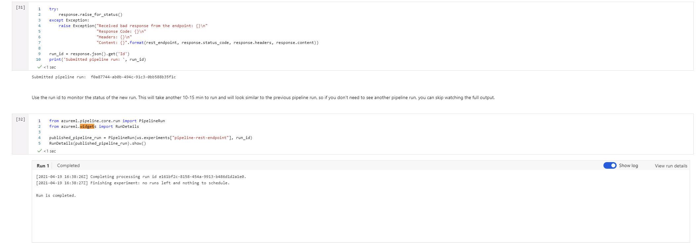
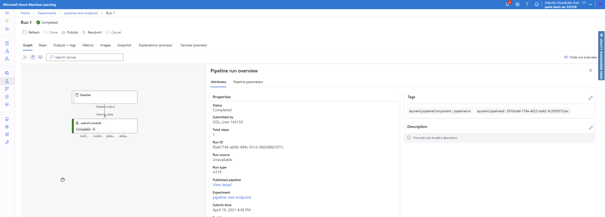

# Operationalizing-Machine-Learning-Udacity-Project2
*NOTE: These files are those modified and used in the Machine Learning Engineer with Microsoft Azure Nanodegree Program, second project: Operationalizing ML*

## Overview
This project facus on the deployment side of an Azure ML model to an Endpoint, where it can be consumed by other users as a web service using a REST API.

An AutoML model is created based on the Bank Marketing dataset, and the best model is deployed for its consumption. The deployement is tested to check that it can be accessed, has the correct access and there is adequate documentation (through Swagger) for those using it. A check is done to verify that the model deployed provides a model prediction from a json package with model data.

Then a pipeline is created and also deployed, and all is checked against the rubric.

A **screencast** showing the architecture and the different models and endpoints in the Azure Studio is shown at the following location: [Udacity-AzureML_project2](https://youtu.be/WRcBkJeVtV4)

And the following diagram provides the architecture followed during the process to obtain the end result:
 would automatically update the model and redeploy it.
 - Creating a benchmark that allows to detect deviation from the baseline would further improve the redeployment.

## Deatils of the Run
As part of the project, several screenshots were taken during the process to demonstrate how it was done. You can find the most interesting examples below:

### Creating the Service Principal and sharing the resource

As this example was done in the provided lab, the service principal could not be created due to the existing permissions restrictions. Same for the sharing. But the following image show the commands that would need to be implemented and how to obtain the user.

### Dataset, Experiments and Models
The following figures show the different datasets and model as a result of the AutoML process, how they have been registered and run, and their results

### Application Insights
Application insights are enabled and shown in the figures below

### Swagger documentation
Swagger was locally deployed to check it worked correctly. The following images show the swagger documentation and its working can also be observed in the screencast

### API Run
The model can be remotely accessed using the REST API, as demonstrated by running the python script that calls it and returns the model results

## Pipelines
The AUtoML model is used to create a pipeline. One is created and deployed and the following sections show proof of the process.

### Pipelines Run

### Pipeline Endpoint

### Dataset for the AutoML model

### Published pipeline overview

This figure shows the published pipeline, with details showing that is active and correctly deployed.

## Notebook
The last details are related to the notebook (in this same project) used to create and publish the pipeline. They show the specific cells where the widget was showing the runs, in case they cannot be seen in the notebook (as the widgets usually do not show in them)

## Scheduled Run
Please see this thread that supports the following data.
[Knowledge - Udacity](https://knowledge.udacity.com/questions/364069)

